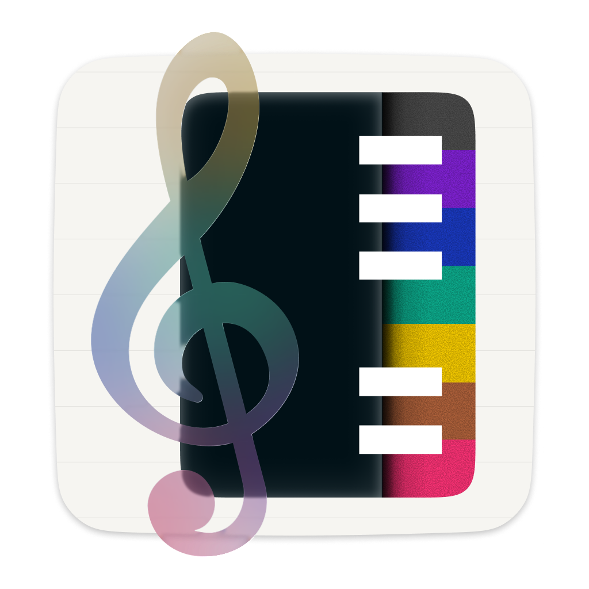
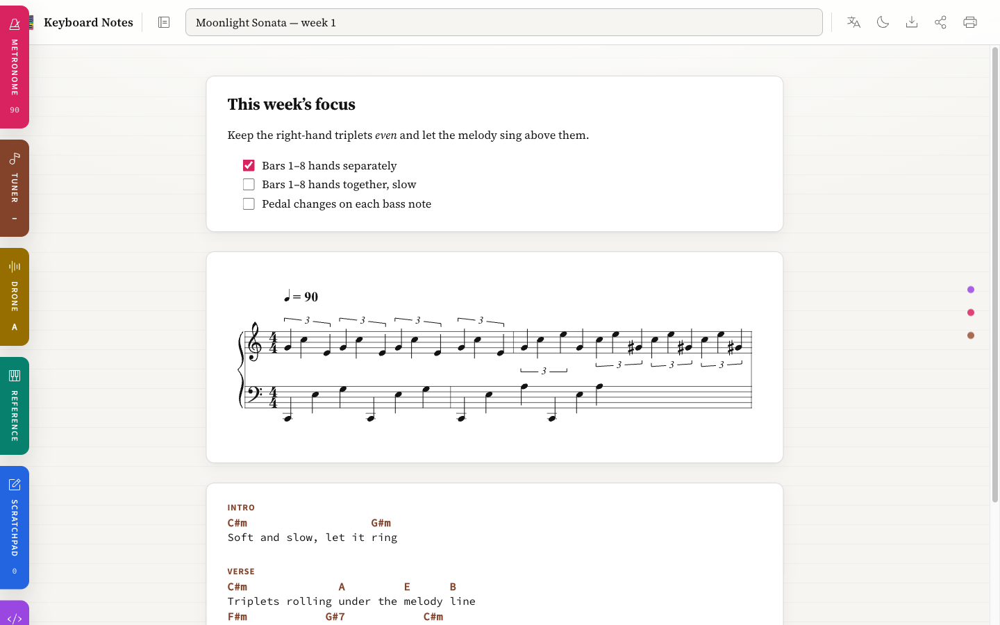

<div align="center">



# Keyboard Notes

**A practice notebook for people learning an instrument.**

Mix written notes, engraved staves you can _hear_, chord charts, recordings, and
sheet-music PDFs into one lesson — then practice against a built-in metronome,
tuner, and drone. On your device, offline, installable like an app.

### [&nbsp;▶&nbsp; Try it live&nbsp; →&nbsp;](https://ygor-the-monster.github.io/keyboard-notes/)

<sub>No sign-up. Open it, make a lesson — it auto-saves to your browser.</sub>

</div>

---

<div align="center">



<sub>One lesson, three cell kinds — a note with practice tasks, an engraved staff you can hear, and a transposable chord chart.</sub>

</div>

## What it is

Think of it like a Jupyter notebook, but for music practice. A **Lesson** is an
ordered stack of **Cells** — and a cell can be any of seven kinds, mixed freely:

| | Kind | What it does |
|---|---|---|
| 📝 | **Note** | Markdown prose with a WYSIWYG toolbar and clickable practice-task checkboxes |
| 🎼 | **Score** | Engraved staff notation ([ABC](https://abcnotation.com/)) with **acoustic-grand playback**, a touch palette, tempo, and grand-staff templates |
| 🎸 | **Cifra** | Chords written over lyrics (a chord chart) — **transposable** to any key |
| 🖼️ | **Image** | Drop / paste / browse, then crop, rotate, recolor, and draw on it with a pen |
| 📄 | **PDF** | Embed sheet music by file or URL, flip pages, and annotate per page |
| 🔊 | **Audio** | Record or import a clip, trim it, and drop timeline **Marks** at key moments |
| 🌐 | **External** | Embed a video or web page by URL (with a graceful offline placeholder) |

Image, PDF, and Audio edits are **non-destructive** — crops, recolors, and pen
strokes layer on top of your original and can always be undone.

## Practice aids

Pull-out tabs that make sound but hold no lesson content — available anywhere:

- 🥁 **Metronome** — sample-accurate (Web Audio lookahead scheduler); a Score cell can click at its own tempo
- 🎯 **Tuner** — live pitch detection, referenced to a tunable A4
- 🎵 **Drone** — hold a reference pitch to play or sing against
- 🎹 **Chord Builder** — build and hear chords

## Why you might like it

- **On-device & private** — your lessons never leave your browser. No account, no server.
- **Works offline** — it's an installable PWA. Add it to your home screen and it runs on a plane.
- **Built for a tablet** — touch palettes, big targets, designed to sit on a music stand.
- **Yours to keep** — export any lesson to JSON for backup or transfer, or Print → PDF.

## Install (Add to Home Screen)

Open the [live app](https://ygor-the-monster.github.io/keyboard-notes/) over
HTTPS and an **Install** button appears in the top bar (or use your browser's
"Add to Home Screen"). It precaches its assets, so after the first visit it
works with no connection.

---

<details>
<summary><b>For developers</b> — stack, local dev, and deploy</summary>

### Tech stack

- **React 19** + **Spectrum 2** (`@react-spectrum/s2`) with the `style` macro
- **rolldown-vite** + `@vitejs/plugin-react-oxc` (oxc-powered)
- **abcjs** (notation + synth), **marked** (Markdown), **pdf.js** + **pdf-lib** (PDF),
  **pitchy** (pitch detection), **@phosphor-icons/react** (icons)
- Storage on-device; non-destructive media overlays applied at view time
- **oxlint** + **oxfmt** (lint/format), **vitest** (unit + browser + type tests)
- A light, manuscript-style sheet — ivory canvas, clean white cells, magenta/seafoam accents

### Develop

```bash
npm install
npm run dev            # Vite dev server
npm run lint           # oxlint
npm run typecheck      # tsgo --noEmit
npm run test           # vitest (unit + browser + types)
npm run format         # oxfmt (write) — format:check to verify
npm run build          # production build → dist/
```

> Spectrum 2's `style` macro is compiled by `unplugin-parcel-macros` (configured
> in `vite.config.js`); the macro plugin must stay first in the plugin list.

### Deploy (GitHub Pages via Actions)

`.github/workflows/deploy.yml` lints, typechecks, tests, builds, and publishes
`dist/` to Pages on every push to `main`.

1. Push this repo to GitHub.
2. **Settings → Pages → Build and deployment → Source: GitHub Actions**.
3. Push to `main` — the workflow builds and deploys; the URL appears in the
   Actions run and on the Pages settings page.

The Vite `base` is relative (`"./"`), so the build works at any project-pages
path. Pages serves HTTPS, which is required for Web Audio / MIDI / mic access.

### Project language

Domain terms (Notebook, Library, Lesson, Cell, Kind, Pull Tab, Original,
Filter, Annotation, Mark…) are defined in [`CONTEXT.md`](CONTEXT.md). Architecture
decisions live in [`docs/adr/`](docs/adr/).

</details>
